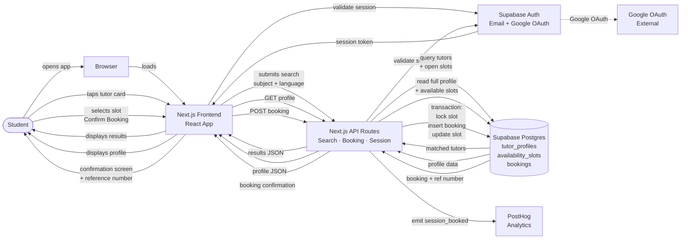

# Architecture Diagram

**Final required file:** `03-build/architecture/architecture-diagram.png`

**Team:** TutorLink Team
**Product:** TutorLink
**Date:** April 16, 2026

---

## 1. Diagram Goal

```text
This diagram shows how a student moves through the tutor search and booking
request across the Sprint 1 system — from browser to auth, search API,
database, and booking confirmation.
```

---

## 2. Required Boxes

| Box | Included? | Notes |
|-----|-----------|-------|
| User (student) | Yes | Entry point — initiates all requests |
| Browser / client app | Yes | Next.js renders in the browser; mobile-first web |
| Frontend application | Yes | Next.js 14 React app — search UI, profile view, booking screens |
| Authentication provider | Yes | Supabase Auth — email verification, Google OAuth, session cookie |
| Backend / server logic | Yes | Next.js API routes — search, booking, session validation |
| Database | Yes | Supabase Postgres — tutor profiles, availability slots, bookings |
| Analytics / event tracking | Yes | PostHog — receives `session_booked` and all other events (Sprint 2 instrumentation; shown in diagram as the target, not yet firing in Sprint 1) |
| External APIs | Yes | Google OAuth (via Supabase Auth) |
| AI touchpoints | Yes — build workflow only | AI tools (Stitch, Claude Code, Copilot) are used in development; no AI model is called at product runtime in Sprint 1 |

---

## 3. Required Arrows

| Arrow | From | To | Label |
|-------|------|----|-------|
| 1 | Student | Browser | opens app |
| 2 | Browser | Supabase Auth | validates session |
| 3 | Supabase Auth | Browser | returns session token |
| 4 | Browser | Next.js Frontend | loads search screen |
| 5 | Student | Next.js Frontend | submits search (subject + language) |
| 6 | Next.js Frontend | Next.js API `/api/tutors/search` | GET search request |
| 7 | Next.js API | Supabase Auth | validates session token |
| 8 | Next.js API | Supabase Postgres | queries tutor profiles + availability slots |
| 9 | Supabase Postgres | Next.js API | returns matched tutors |
| 10 | Next.js API | Next.js Frontend | returns results JSON |
| 11 | Student | Next.js Frontend | taps tutor card |
| 12 | Next.js Frontend | Next.js API `/api/tutors/[id]` | GET profile request |
| 13 | Next.js API | Supabase Postgres | reads full profile + open slots |
| 14 | Supabase Postgres | Next.js API | returns profile data |
| 15 | Next.js API | Next.js Frontend | returns profile JSON |
| 16 | Student | Next.js Frontend | selects slot + taps Confirm Booking |
| 17 | Next.js Frontend | Next.js API `/api/bookings` | POST booking request |
| 18 | Next.js API | Supabase Postgres | transaction: lock slot, insert booking, update slot |
| 19 | Supabase Postgres | Next.js API | returns booking record + reference number |
| 20 | Next.js API | PostHog | emits `session_booked` event |
| 21 | Next.js API | Next.js Frontend | returns booking confirmation |
| 22 | Next.js Frontend | Student | shows confirmation screen with reference number |

---

## 4. Mermaid Diagram

Export this as `architecture-diagram.png` using Mermaid Live Editor (https://mermaid.live) or the VS Code Mermaid extension.



**Diagram notes:**
- Solid arrows = Sprint 1 request flow
- Dashed arrow = Google OAuth external call (only during signup)
- PostHog receives events from the API route (server-side), not from the browser client — this ensures events fire even if a browser ad-blocker is active
- Database is shown with a cylinder shape to visually distinguish it from service boxes
- AI tools (Stitch, Claude Code, Copilot) are used in the **development workflow only** — they do not appear in the runtime diagram because no AI model is called at runtime in Sprint 1

---

## 5. AI Annotation

**AI in product runtime:** None in Sprint 1. No model is called when a student searches, views a profile, or confirms a booking. All logic is deterministic SQL filtering and Postgres transactions.

**AI in development workflow only:** Google Stitch (UI scaffolding), Claude Code (booking API, concurrency logic), GitHub Copilot (inline completion). These tools produce code that developers review, annotate, and commit. They are not represented in the architecture diagram because they do not exist at runtime.

**Sprint 3 candidate:** A tutor recommendation feature using Google AI Studio is under consideration. If added, it would appear as an additional box between the API routes layer and a Google AI Studio API call, with an arrow labeled "GET recommendation." It will not be added to this diagram until it is in scope.

---

## 6. Final Export Check

- [x] Boxes match the written system design (Section 3 of system-design.md)
- [x] Arrows are labeled with action words
- [x] Database is visually distinct (cylinder shape in Mermaid)
- [x] Auth is shown where it happens (session validation on every API call)
- [x] Analytics is shown where events fire (API route → PostHog, server-side)
- [x] AI annotation is explicit (build workflow only, not runtime)
- [ ] Diagram readable at normal zoom — confirm after PNG export
- [ ] PNG exported to `03-build/architecture/architecture-diagram.png` and committed

**Export instructions:**
1. Copy the Mermaid block above
2. Paste into https://mermaid.live
3. Click Download PNG
4. Save as `architecture-diagram.png`
5. Commit to `03-build/architecture/architecture-diagram.png`

---

*Architecture Diagram | TutorLink Team | CS-PD-2026 | Spring 2026*