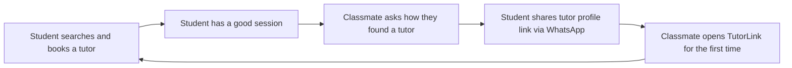

# Loops and Moats Narrative

**Team:** TutorLink Team
**Product:** TutorLink
**Document version:** 1.0
**Last updated:** May 8, 2026

---

## 1. Viral Loop Analysis

### Does your product have a viral loop?

**Answer:** Partial — one organic loop exists today; one designed loop is in Sprint 3.

**Organic loop (active now):** When a student books a tutor through TutorLink and has a good session, they are likely to recommend the platform to classmates who ask how they found a tutor — which is exactly the conversation that happens in every programme group chat. This is a word-of-mouth loop that existed before the platform (Interview 1, TK: "My friend gave me the last name directly and said she had used her personally") and TutorLink formalises it by giving satisfied students a profile link to share rather than just a name.

**Designed loop (Sprint 3):** The `tutor_profile_shared` feature allows a student to share a tutor's TutorLink profile via WhatsApp deep link. This converts the informal vouching behaviour we observed in every interview into a structured viral action that brings new users into the platform directly.

### Loop Diagram



### K-Factor Calculation

```
K = invitations sent per user × conversion rate of invitations
```

**Invitations per user (i):** 0.4
- Source: Estimated from interview data. TK (Interview 1) shared a tutor name with at least one classmate. AB (Interview 2) asked two peers for help finding a tutor — each of those peers is a potential recipient of a future share. We estimate 1 in 2.5 students who successfully book a session will share the profile with at least one other person within the same semester. This is conservative; the sharing motivation is high (vouching is the primary trust mechanism in the current system). We will measure this directly via `tutor_profile_shared` events in Sprint 3.

**Conversion rate of invitations (c):** 40%
- Source: Estimated from the smoke test. A WhatsApp message from a trusted peer describing a tool that solves the tutor search problem is a warm referral from someone the recipient knows. We estimate 40% of recipients who receive a direct profile share will open the link and proceed to signup. This is higher than cold channel conversion because of the personal vouching context. We will validate this with `view_source = direct_link` → signup funnel data in Sprint 3.

**K-factor:** K = 0.4 × 0.40 = **0.16**

### Interpretation

| K value | Meaning |
|---------|---------|
| K < 1 | Loop reduces effective CAC but does not generate compounding growth on its own |
| K = 1 | Steady-state replacement; loop sustains user count |
| K > 1 | Compounding viral growth |

**Our K is 0.16, which means:** For every 100 students who book a session, approximately 16 additional students join the platform through peer sharing — without any acquisition spend. This meaningfully reduces our blended CAC (each organically acquired user costs zero in channel spend) but does not produce compounding viral growth on its own. The loop is a CAC reducer, not a growth engine — our primary acquisition still requires active seeding via the three channels in our growth strategy.

The K-factor can improve significantly if the designed Sprint 3 share mechanic (one-tap WhatsApp deep link) reduces friction in the sharing action. The current estimate assumes the share requires the student to copy and paste a link; a native share button could increase (i) from 0.4 to 0.6, raising K to 0.24.

---

## 2. Network Effects Analysis

### Does your product have network effects?

**Answer:** Yes — two-sided and local.

### Type

- **Two-sided:** Students need tutors and tutors need students. A platform with no tutors has zero value to students; a platform with no students has zero value to tutors. Each side's participation directly increases the value of the platform to the other side.
- **Local:** The network effects are geographically and institutionally concentrated. A student at KIU benefits from KIU tutors being on the platform. A student at TSU benefits from TSU-adjacent tutors. The network does not need to be national to be valuable — it needs to be dense within a specific university community.

**Why this type fits:** Our interview data confirmed the local structure. GM (Interview 3) found a tutor through the KIU CS network. NA (Interview 7) found a tutor through a TSU connection. The tutor pool is not national — it is concentrated in specific university communities. A platform that is dense at KIU has strong local network effects for KIU students without needing to be present at every Georgian university simultaneously.

### Threshold

At what point do network effects become noticeable to a student opening TutorLink for the first time?

**Critical mass:** 15 active tutor profiles at KIU covering at least 5 distinct subjects, with at least 8 profiles showing availability this week.

**Reasoning:** A student who opens TutorLink searching for a mathematics tutor needs to see at least 2–3 results to feel that the platform has meaningful supply. If only one tutor appears in search results — or none — the student concludes the platform is not ready and leaves. 15 profiles covering 5 subjects gives enough density that most subject searches return at least 2 results. 8 profiles showing current availability ensures the search is not purely theoretical — there are tutors a student can actually book this week.

**Strategy to reach the threshold:** We will not distribute TutorLink widely to students until 15 active tutor profiles are live. Sprint 2 (S2-01) enables tutor self-registration. Before launching student acquisition via group chat posts, Mari and Lizi personally onboard tutors from our interview network — MT (Interview 5) and referrals from GM (Interview 3) and the outreach tracker. Target: 15 tutor profiles live by the end of Sprint 2 Week 1 (May 14). Student acquisition channels activate after this threshold is confirmed in PostHog.

---

## 3. Defensibility Analysis

### Possible Moats

- **Brand:** Weak today. TutorLink has no brand recognition. Could become meaningful in 12 months if we are the first product students associate with finding tutors in Georgia.
- **Data:** Weak today. Growing. Every session booked generates data on subject demand, tutor quality (via reviews), and pricing norms. After 500+ bookings, we have a dataset that no competitor entering the market would have at launch.
- **Switching costs:** Medium. A student who has found and booked a tutor through TutorLink has an established relationship that lives on the platform (booking history, reviews, saved tutor). Switching to WhatsApp-based search means returning to the exact pain they used TutorLink to escape. Tutors who have maintained their profile and accumulated reviews have a stronger reason still — their reputation is stored in TutorLink, not transferable.
- **Network effects:** Medium — and growing. See Section 2. A platform with 50 active KIU tutors and 200 student bookings has a network advantage that a new entrant cannot replicate at launch.
- **Distribution lock-in:** Weak today. We do not own a proprietary channel. The institutional partnership with the KIU international student office (if secured) is a form of distribution lock-in — a new entrant would need to negotiate the same relationship.
- **Regulatory:** None.
- **Speed of iteration:** Strong today, temporarily. We are four developers who can ship a feature in a sprint. A large competitor (a Georgian telco or an international tutoring platform localising for Georgia) would take months to understand the market and build an equivalent product.

### Our Actual Moat (Today)

Honestly: none that a well-funded competitor could not overcome in 6–12 months. Our current advantages are speed of iteration (we move faster than a large company can respond), local knowledge (we have 8 customer discovery interviews and a network of real Georgian tutors), and first-mover positioning in a market with no direct competitor. These are temporary advantages that buy us time to build toward our planned moat.

### Our Planned Moat (12 Months Out)

**Data + reviews network.** After 12 months of operation, TutorLink will have a dataset of tutor quality (star ratings, review text, subject expertise, booking frequency) that no new entrant can replicate at launch. A student choosing between TutorLink and a new competitor will see 200 reviews on TutorLink and zero on the new platform. This is the review moat that Google Maps and Airbnb used to defend their positions — and it compounds with time and usage. We are actively building toward this by making review submission a Sprint 3 priority (S3-01).

---

## 4. Riskiest Assumption

**Riskiest assumption:** Tutors will actively maintain their TutorLink profiles — updating availability slots and responding to booking requests — after the initial onboarding.

**Current value in our model:** We assume 80% of onboarded tutors remain active (availability updated at least weekly) after Sprint 2 goes live.

**Why it is the riskiest:** Every part of our growth model depends on supply-side liquidity. If tutors create profiles and then stop updating their availability — because it takes effort, because they fill up via WhatsApp before checking TutorLink, or because they do not see enough student demand to justify the maintenance — the student-facing search experience degrades rapidly. A student who searches for a mathematics tutor and sees three profiles all showing "no slots available this week" will not return. This is the supply abandonment risk that killed early two-sided marketplace attempts in thin markets. We have zero data on tutor retention because the product is not yet live.

**How we will validate it in Sprint 2:** Mari tracks, in PostHog, the number of tutor-side `user_session_started` events per active tutor per week after S2-01 launches. If any tutor has not updated their availability within 7 days of onboarding, Mari sends a direct WhatsApp check-in. At the Sprint 2 Review, Lizi reports: "X of Y onboarded tutors are still active." If the number is below 70%, we discuss adding a lightweight reminder mechanic (WhatsApp message or email at the start of each week asking tutors to confirm their slots) before Sprint 3.

---

## 5. Summary Statement

TutorLink acquires students through three zero-cost channels: the KIU International Student Office (reaching the highest-pain segment at orientation), programme WhatsApp groups (reaching students in the exact context where the problem lives), and tutor-side word of mouth (leveraging tutors' existing student relationships to seed demand). Our K-factor is 0.16, which meaningfully reduces effective CAC without generating compounding viral growth on its own — the loop is a multiplier on top of active seeding, not a replacement for it. We have local two-sided network effects that become defensible once we reach 15 active tutor profiles at KIU: below that threshold we have no product; above it, every new tutor makes TutorLink more valuable to every student and vice versa. Our planned moat is a reviews and rating dataset that compounds with every booking — a new entrant in 12 months faces a platform with hundreds of verified tutor reviews that they cannot replicate at launch.

---

**Filed by:** Nino Tsutskiridze, Lizi Margvelashvili, Luka Khimshiashvili, Mari Janjghava