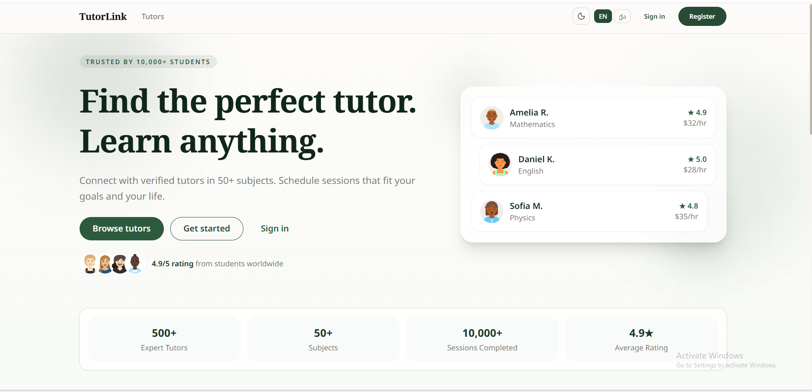
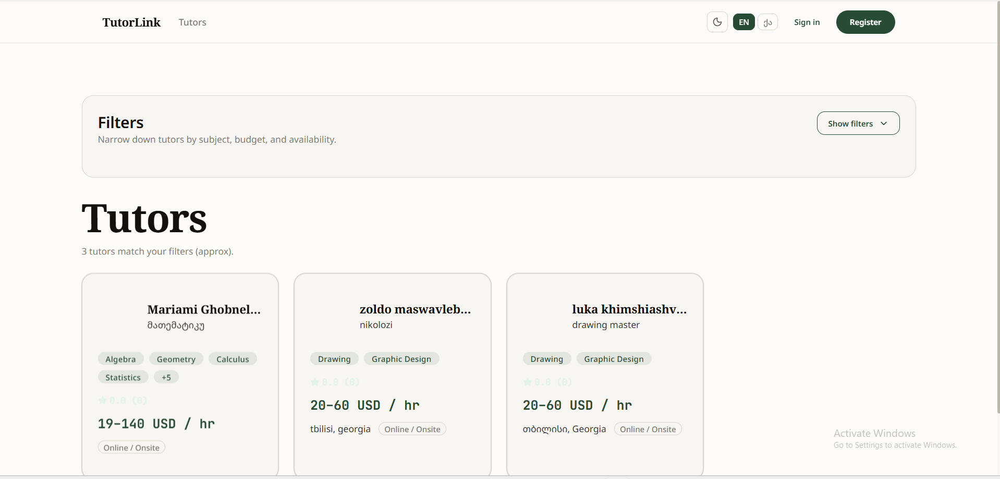
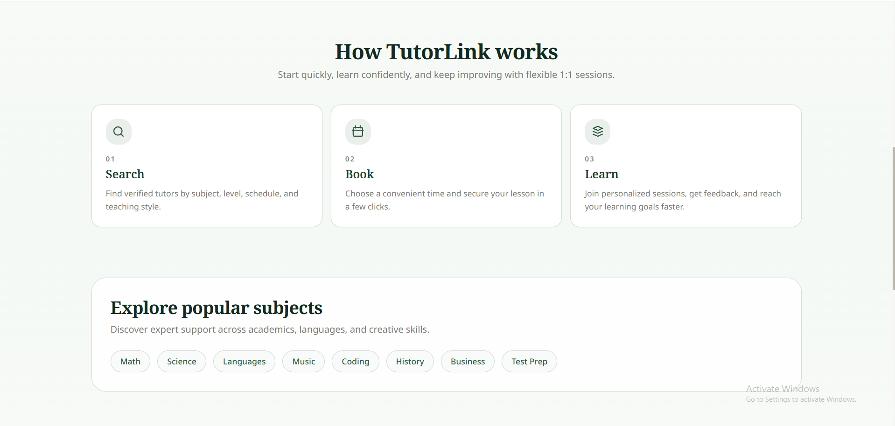

<<<<<<< HEAD
# CS-PD-2026: Product Development for Software Engineers

**Institution:** Kutaisi International University  
**Course Code:** CS-PD-2026  
**Semester:** Spring 2026 | March 5 -- June 2026  
**Instructor:** Zeshan Ahmad | zeshan.ahmad@kiu.edu.ge  
**Office Hours:** Book via email for Google Meet  

---

## What This Course Is

This is not a traditional software engineering course. You will not be given requirements to implement. You will not be graded on code quality alone.

You are being treated as a founder. Over 15 weeks you will take a product from zero -- no problem, no user, no idea -- to a live working MVP with real users, evidence-based product decisions, and an investor-ready presentation. Every lab, every deliverable, and every checkpoint is a step in that journey.

The single thread running through the entire semester is your capstone project. It is not a side activity. It is the course. The lectures give you the frameworks. The labs are where you apply them. The checkpoints are where you prove you have.

---

## Schedule at a Glance

| Session | Day | Time | Notes |
|---------|-----|------|-------|
| Lecture | Thursday | 12:00 -- 14:00 | All students together |
| Lab Group A | Thursday | 14:00 -- 16:00 | Immediately after lecture |
| Lab Group B | Friday | 13:00 -- 15:00 | Day after lecture |

**Homework deadline:** Every Thursday at 23:59, before the next week's lecture.

Labs begin in **Week 2**. There is no lab in **Week 9** (Midterm). This gives a total of **13 labs** across the semester.

---

## The 5-Module Journey

The course is structured in five progressive modules. Each module builds directly on the previous one.

```
MODULE 1          MODULE 2          MODULE 3          MODULE 4          MODULE 5
Problem Space     Solution Space    Synthesis         Market Space      Launch
Weeks 1-3         Weeks 4-7         Weeks 8-9         Weeks 10-14       Week 15
─────────────     ─────────────     ─────────────     ─────────────     ─────────────
Discover and      Prototype and     Build and         Scale and         Demo Day
define            test              reflect           sustain           pitch
```

**The logic:** You cannot design a solution before you understand the problem. You cannot build before you have validated the design. You cannot market before you have something real to show. The module sequence enforces this discipline.

---

## Full 15-Week Schedule

| Week | Dates | Lecture Topic | Lab | Key Events |
|------|-------|--------------|-----|------------|
| **1** | Mar 5 | Product Mindset and Team Formation. Product thinking, startup fundamentals, team dynamics, roles, conflict resolution, communication protocols | No Lab | First class |
| **2** | Mar 12 | Customer Discovery and Interview Methods. The Mom Test, JTBD framework, interview techniques, active listening, bias avoidance | **Lab 1:** Team Foundation. Team contract, individual 3H problem brainstorm, GitHub setup | Homework due Thu Mar 19 |
| **3** | Mar 19 | Design Thinking and Prototyping. Design sprint methodology, ideation techniques, How Might We, solution concepts | **Lab 2:** Discovery Launch. Select team problem via Four Filters, commit ICP, write interview script v1, schedule first interviews | Homework due Thu Mar 26 |
| **4** | Mar 26 | Metrics and Analytics Foundations. AARRR framework, event schema design, instrumentation, Mixpanel and Amplitude intro | **Lab 3:** Interviews and Synthesis. Conduct and document interviews, pattern observations, problem statement review | **Checkpoint 1 Due** (10 pts) |
| **5** | Apr 2 | Competitive Landscape and Positioning. Market mapping, differentiation, positioning statements, Blue Ocean strategy | **Lab 4:** Synthesis and Problem Validation. Affinity mapping, pattern analysis, Five Whys, evidence-based final problem statement | **Quiz 1** (7.5 pts) |
| **6** | Apr 9 | Solution Design and Wireframing. User flows, information architecture, wireframing principles, Figma basics, design critique | **Lab 5:** Design Sprint. Solution brainstorming, sketch to wireframe, design decisions document | Homework due Thu Apr 16 |
| **7** | Apr 16 | Agile Fundamentals and Sprint Planning. Scrum roles, ceremonies, story points, velocity, burndown charts, GitHub Projects | **Lab 6:** Prototype and User Testing. Lo-fi prototype, user testing sessions, usability findings | Homework due Thu Apr 23 |
| **8** | Apr 23 | Technical Architecture and System Design. Architecture patterns, tech stack decisions, risk spikes, scalability considerations | **Lab 7:** Architecture and Sprint Planning. System design document, tech stack selection, Sprint 1 plan, GitHub setup for build phase | **Checkpoint 2 Due** (10 pts) |
| **9** | Apr 30 | **Midterm Exam** (closed book, 90 minutes). Covers Modules 1 and 2 content: discovery, JTBD, AARRR, design thinking, Agile fundamentals | **No Lab** | **Midterm Exam** (15 pts) |
| **10** | May 7 | Go-to-Market Strategy. GTM frameworks, channel selection, landing page design, early adopter acquisition, outbound sequencing | **Lab 8:** MVP Sprint 1 Review and Sprint 2 Planning. Sprint 1 demo, retrospective, Sprint 2 commitments | Homework due Thu May 14 |
| **11** | May 14 | Growth, Retention, and Unit Economics. LTV, CAC, payback period, retention curves, cohort analysis, pricing strategy | **Lab 9:** MVP Sprint 2 Review and GTM Experiments. Sprint 2 demo, launch landing page, first GTM experiment design | Homework due Thu May 21 |
| **12** | May 21 | Legal, IP, and Fundraising Fundamentals. IP strategy, open source licensing, equity basics, SAFE notes, investor narrative | **Lab 10:** MVP Sprint 3 and Analytics Review. Sprint 3 demo, analytics dashboard review, experiment results | **Checkpoint 3 Due** (10 pts) · **Quiz 2** (7.5 pts) |
| **13** | May 28 | Investor Materials and Pitch Craft. Pitch deck structure, storytelling, financial model basics, one-pager, data room | **Lab 11:** GTM Results and Financial Model. Experiment analysis, unit economics document, 12-month model | Homework due Thu Jun 4 |
| **14** | Jun 4 | Demo Day Preparation. Pitch practice, storytelling refinement, Q&A technique, venture packet final checks | **Lab 12:** Pitch Rehearsal and Venture Packet Review. Full pitch run-through, peer feedback, final repo audit | Homework due Thu Jun 11 |
| **15** | Jun 11 | **Demo Day** | **Lab 13:** Demo Day presentations | **Checkpoint 4: Demo Day** (10 pts) |

---

## The Capstone Project

Your capstone project is a single GitHub repository that you build incrementally from Week 1 to Week 15. By Demo Day it is your venture packet -- the complete evidence trail of a product built with discipline, from discovery through launch.

### Capstone Repository Structure

Your team repository follows this structure. Each folder is introduced when you reach that phase -- do not create folders in advance.

```
product-capstone-2026/
│
├── README.md                          # Live project overview (updated weekly)
├── .gitignore
│
├── 00-foundation/                     # Weeks 1-2: Team and Problem
│   ├── team-contract.md
│   ├── all-problem-statements.md
│   ├── team-problem-statement.md      # Added in Lab 2
│   └── team-icp.md
│
├── 01-discovery/                      # Weeks 2-5: Customer Discovery
│   ├── interview-script-v1.md
│   ├── interview-script-v2.md
│   ├── interview-logs/                # One file per interview (10+ required)
│   ├── synthesis/
│   │   ├── affinity-map.md
│   │   ├── patterns-analysis.md
│   │   └── final-problem-statement.md
│   └── outreach/
│       ├── outreach-messages.md
│       └── interview-scheduling-tracker.md
│
├── 02-design/                         # Weeks 4-8: Design and Prototyping
│   ├── design-sprint/
│   │   ├── brainstorm-notes.md
│   │   ├── sketches/
│   │   └── design-decisions.md
│   ├── prototypes/
│   │   ├── low-fidelity/
│   │   └── high-fidelity/
│   │       └── figma-link.md
│   └── user-testing/
│       ├── test-plan.md
│       ├── test-session-logs/
│       └── usability-findings.md
│
├── 03-build/                          # Weeks 7-12: MVP Development
│   ├── architecture/
│   │   ├── system-design.md
│   │   ├── tech-stack.md
│   │   ├── architecture-diagram.png
│   │   └── risk-spikes.md
│   ├── src/                           # Your source code lives here
│   ├── analytics/
│   │   ├── event-schema.md
│   │   └── dashboard-link.md
│   └── roadmap/
│       └── product-roadmap.md
│
├── 04-gtm/                            # Weeks 9-14: Go-to-Market
│   ├── experiments/
│   ├── financials/
│   │   ├── unit-economics.md
│   │   └── 12-month-model.xlsx
│   ├── traction/
│   └── marketing/
│       └── landing-page-link.md
│
├── 05-fundraising/                    # Weeks 12-15: Investor Materials
│   ├── pitch-deck.pdf
│   ├── one-pager.pdf
│   └── data-room/
│
└── milestones/                        # One file per key week
    ├── week-02-milestone.md
    ├── week-04-milestone.md           # Checkpoint 1
    ├── week-08-milestone.md           # Checkpoint 2
    ├── week-12-milestone.md           # Checkpoint 3
    └── week-15-milestone.md           # Checkpoint 4 / Demo Day
```

# TutorLink

## Live MVP

The team collaborated on a deployed tutoring platform MVP available at:

https://tutoring-lyart.vercel.app/en

## MVP Features

- Browse tutors
- View tutor profiles
- Multilanguage support
- Tutor discovery flow
- Student-focused UI

# TutorLink

A tutoring discovery platform helping university students quickly find reliable tutors for academic support.

---

## Problem

University students often struggle to find trustworthy tutors through scattered Facebook posts, Telegram groups, and word-of-mouth recommendations. Existing methods are unstructured, time-consuming, and lack transparency.

---

## Solution

TutorLink provides a structured tutoring platform where students can:

* browse tutors
* compare tutor profiles
* discover tutors by subject
* access multilingual support
* quickly connect with tutors

---

## Live MVP

Deployed application:

https://tutoring-lyart.vercel.app/en

---

## Features

* Tutor discovery
* Detailed tutor profiles
* Responsive UI
* Multilanguage support
* Student-focused browsing experience

---

## Screenshots

### Homepage



### Tutor Profiles



### Mobile View



---

## User Validation

The team conducted usability testing sessions with university students.

### Key Findings

* Students preferred structured tutor profiles
* Users trusted detailed tutor descriptions
* Multilanguage support improved usability
* Students preferred the platform over Facebook groups

Testing files are available in:

02-design/user-testing/

---

## Experiment Evidence

The team conducted a tutor discovery experiment to evaluate whether students prefer structured tutoring platforms over informal social media searching.

Results showed that users found tutor discovery:

* faster
* more organized
* more trustworthy

Experiment documentation:

04-gtm/experiments/

---

## Tech Stack

### Frontend

* React
* Vite
* TailwindCSS

### Deployment

* Vercel

### Version Control

* GitHub

### Product Design

* Figma

---

## Architecture

The MVP uses a frontend-focused architecture deployed through Vercel.

Architecture documentation:

03-build/architecture/

---

## Traction

Early validation results:

* 12 student test users
* 5 students expressed intent to use during exams
* 3 tutors expressed interest in joining the platform

---

## Team Contributions

The project involved collaboration across:

* frontend development
* product design
* usability testing
* documentation
* experimentation
* validation research

---

## Future Roadmap

* Tutor ratings and reviews
* Advanced search filters
* Booking system
* Messaging functionality
* Verified tutor badges

---


### What the Venture Packet Must Contain by Week 15

A complete venture packet -- the standard by which your work will be assessed at Demo Day -- includes all of the following:

- **Discovery:** 10+ interview logs with verbatim quotes, affinity map, patterns analysis, evidence-based final problem statement
- **Design:** Low and high fidelity prototypes with a documented design decision rationale, usability testing logs
- **Build:** Working MVP deployed to a live URL, architecture document, analytics integration with real event data
- **GTM:** At least one completed GTM experiment with results, landing page, unit economics model
- **Pitch:** Investor-grade pitch deck (8-12 slides), one-pager, 5-minute live presentation on Demo Day

The venture packet is assessed not just on whether each file exists but on whether the evidence trail is coherent. Your pitch deck must be supported by your interview logs. Your architecture must match your build. Your analytics must show real usage data. Artefacts that exist but do not connect to each other will not score well.

---

## How Labs Work

Each lab follows the same structure:

**Before lab:** Pre-reading or a prerequisite task is assigned at the end of the previous lab. Coming unprepared means lost in-lab time you cannot recover.

**During lab (120 minutes):**
- First 10 minutes: context-setting, questions from the previous week
- Core activity block 1 (40-50 minutes): the main lab work
- Core activity block 2 (40-50 minutes): second phase of lab work or peer review
- Final 10 minutes: wrap-up, homework briefing, questions

**After lab:** Homework is due by **Wednesday 23:59** -- before the next lab. This gives you roughly one week from each lab to complete and commit your deliverables.

**Submission:** All deliverables are submitted via your team GitHub repository. There is no LMS upload unless explicitly stated. Commit and push your work, create the appropriate submission tag, and email the instructor with your repository URL and tag confirmation.

**Grading:** Labs are graded on completed deliverables, not on participation. Showing up but submitting nothing scores zero. Showing up and submitting quality work scores full marks.

---

## Homework Policy

**Deadline: Wednesday 23:59 every week.**

This deadline is Wednesday midnight because Lab Group A runs on Thursdays and Lab Group B runs on Fridays. The Wednesday midnight deadline means both groups complete their homework from the previous lab before the new lecture begins.

**Late penalty:** 10% deducted per 24 hours, up to 72 hours. Beyond 72 hours requires instructor approval before submission is accepted.

**The rule about homework:** Homework builds directly on lab work. If you leave lab with incomplete deliverables and then fail to complete them during the week, you arrive at the next lab without the foundation that lab requires. The late penalty exists, but the deeper cost is falling behind on the capstone.

---

## Assessment

| Component | Points | When | Type |
|-----------|--------|------|------|
| **Checkpoint 1: Discovery** | 10 | Week 4 | Team |
| **Checkpoint 2: Design and Architecture** | 10 | Week 8 | Team |
| **Checkpoint 3: MVP Build** | 10 | Week 12 | Team |
| **Checkpoint 4: Demo Day** | 10 | Week 15 | Team |
| **Participation and Labwork** | 10 | Weekly | Individual |
| **Quiz 1** | 7.5 | Week 5 | Individual |
| **Quiz 2** | 7.5 | Week 12 | Individual |
| **Midterm Exam** | 15 | Week 9 | Individual |
| **Final Exam** | 20 | Final period | Individual |
| **TOTAL** | **100** | | |

### Checkpoints (40 points total)

The four checkpoints are the milestones of your capstone project. Each is assessed as a team grade with a peer assessment modifier applied to individual scores.

**Checkpoint 1 -- Discovery (Week 4, 10 pts)**  
Evidence of rigorous customer discovery. Minimum 10 interview logs with verbatim quotes, affinity map, pattern analysis, and a final evidence-based problem statement. The standard is: could a new team member read your discovery folder and fully understand the problem you are solving and why?

**Checkpoint 2 -- Design and Architecture (Week 8, 10 pts)**  
Evidence of validated solution design. Lo-fi and hi-fi prototypes, usability testing logs, system architecture document, tech stack decisions, Sprint 1 plan. The standard is: does your design trace back to specific discovery insights?

**Checkpoint 3 -- MVP Build (Week 12, 10 pts)**  
A working, deployed MVP with real users. Live URL, analytics integration with at least one week of real event data, sprint retrospectives, and a GTM experiment with documented results. The standard is: is it live and are real people using it?

**Checkpoint 4 -- Demo Day (Week 15, 10 pts)**  
A 5-minute investor-facing presentation. Pitch deck, one-pager, live product demo, and answers to Q&A from the instructor and any guest evaluators. The standard is: would a reasonable seed investor want to know more?

### Participation and Labwork (10 points)

Graded weekly at 0.5 points per class session for prepared work, active discussion, and a short exit ticket. Evidence is logged in the LMS. This component rewards consistent engagement over the semester, not heroic effort in Week 14.

### Quizzes (15 points total)

Two written quizzes, each 7.5 points. Short answer and multiple choice covering product concepts, frameworks, and analytics from the lecture content. Quiz 1 in Week 5 covers Modules 1-2. Quiz 2 in Week 12 covers Modules 3-4. Quizzes are individual and closed-note.

### Exams (35 points total)

**Midterm (15 pts, Week 9):** Closed book. Covers the full curriculum to date: discovery, design thinking, Agile, and analytics foundations. 90 minutes.

**Final Exam (20 pts, Final period):** Closed book. Covers the full semester. Questions will require application of frameworks to new scenarios, not recall of definitions. 120 minutes.

### Team vs Individual Grades

Checkpoints are team grades but each team member's individual score is adjusted by a peer assessment multiplier. If your team scores 8/10 on Checkpoint 1 and your peer assessment multiplier is 0.9, your individual score is 7.2. The multiplier is calculated from peer review submissions completed by your teammates.

A team member who consistently under-contributes will not receive the full team grade regardless of the team's overall performance.

---

## Grading Summary by Lab

Each lab is worth up to 15 points, contributing to the Participation and Labwork component. The grading breakdown for each lab is in that lab's `GRADING-RUBRIC.md` file.

| Lab | Week | Topic | Points |
|-----|------|-------|--------|
| Lab 1 | 2 | Team Formation and Problem Brainstorming | 15 |
| Lab 2 | 3 | Discovery Launch | 15 |
| Lab 3 | 4 | Interview Execution | 15 |
| Lab 4 | 5 | Synthesis and Problem Validation | 15 |
| Lab 5 | 6 | Design Sprint | 15 |
| Lab 6 | 7 | Prototype and User Testing | 15 |
| Lab 7 | 8 | Architecture and Sprint Planning | 15 |
| -- | 9 | **Midterm -- No Lab** | -- |
| Lab 8 | 10 | MVP Sprint 1 Review | 15 |
| Lab 9 | 11 | MVP Sprint 2 and GTM | 15 |
| Lab 10 | 12 | MVP Sprint 3 and Analytics | 15 |
| Lab 11 | 13 | GTM Results and Financial Model | 15 |
| Lab 12 | 14 | Pitch Rehearsal and Venture Packet Review | 15 |
| Lab 13 | 15 | **Demo Day** | 15 |

---

## Repository Structure for This Course Repo

This is the course repository, not your team's capstone repository. The two are different things.

```
PRODUCT-DEV-FOR-SOFTWARE-ENGINEERS-SP26/
│
├── README.md                  # This document
│
├── Lab 1/                     # Team Formation and Problem Brainstorming
├── Lab 2/                     # Discovery Launch
├── Lab 3/                     # Interview Execution
├── Lab 4/                     # Synthesis and Problem Validation
├── Lab 5/                     # Design Sprint
├── Lab 6/                     # Prototype and User Testing
├── Lab 7/                     # Architecture and Sprint Planning
├── Lab 8/                     # MVP Sprint 1 Review
├── Lab 9/                     # MVP Sprint 2 and GTM
├── Lab 10/                    # MVP Sprint 3 and Analytics
├── Lab 11/                    # GTM Results and Financial Model
├── Lab 12/                    # Pitch Rehearsal
└── Lab 13/                    # Demo Day
```

Each lab folder contains:

```
Lab N/
├── README.md              # Student-facing lab guide with full instructions
├── QUICKSTART.md          # 2-minute reference card for use on lab day
├── GRADING-RUBRIC.md      # Full grading rubric for that lab
├── INSTRUCTOR-GUIDE.md    # Word-for-word instructor script (not for students)
├── templates/             # Fill-in templates to copy into your team repo
├── resources/             # Reference materials and framework guides
└── examples/              # Completed examples for calibration
```

---

## Team Setup

All teams must be formed by the end of Lab 1. Teams are 3 or 4 members. No solo work is permitted in this course. The capstone project requires the volume of work -- especially in the discovery phase -- that a solo student cannot produce to the required standard.

### Roles

| Role | Accountable For |
|------|----------------|
| **Program Lead** | Deadlines, submissions, team health, conflict resolution tiebreaker |
| **Discovery Lead** | Interview quality, synthesis, customer insight depth |
| **Tech Lead** | Repository integrity, code quality, architecture decisions |

On a team of four, the fourth member doubles the role with the highest workload for the current phase.

### Team Contract

Every team signs a team contract in Lab 1 using the provided template. The contract governs roles, decision-making, conflict resolution, and contribution tracking. It is a living document committed to your team repository. It will be referenced during peer assessment at the midpoint and end of semester.

---

## Academic Integrity

Everything you submit must be your team's own work. This includes:

**Problem statements:** Must trace back to personal observation. AI-generated problem statements are not permitted in Lab 1 and will be returned without credit.

**Interview logs:** Must document real conversations with real people. Fabricated interviews are an integrity violation and will result in a zero on the associated checkpoint.

**Code:** Must be written by your team. Use of open-source libraries with proper attribution is fine. Submitting code written by AI tools without disclosure, or submitting another team's code, is not.

**Pair collaboration:** Pairing with another team on a specific task (e.g., a user testing session) is permitted with attribution. Submitting another team's deliverables as your own is not.

If you are uncertain whether something is permitted, ask before submitting, not after.

---

## Getting Help

**Office hours:** Book a Google Meet via email at zeshan.ahmad@kiu.edu.ge. Include your team name, what you are stuck on, and two or three time slots that work for you.

**During labs:** Instructor checkpoint rounds happen at 30, 60, and 105 minutes. Raise your hand at any point.

**Between labs:** Email is the primary channel. Expect a response within 24 hours on weekdays. If something is blocking your team's progress and cannot wait, say so clearly in the subject line.

**The rule on waiting:** Do not wait until the Thursday night deadline to discover a blocker. Surface problems early. A blocker identified on Monday can almost always be resolved before Thursday. A blocker discovered at 23:00 on Thursday usually cannot.

---

## Key Dates

| Date | Event |
|------|-------|
| Thu Mar 5 | Week 1 lecture -- first class |
| Thu Mar 13 | Lab 1 Group A |
| Fri Mar 14 | Lab 1 Group B |
| Thu Apr 30 | Midterm Exam -- no lab this week |
| Week of Jun 9 | Demo Day (exact date confirmed in Week 14) |
| Final period | Final Exam (date per KIU academic calendar) |

Checkpoint deadlines are listed in each lab's README and confirmed in the lecture of the week they fall due.

---

*CS-PD-2026 | Kutaisi International University | Spring 2026 | zeshan.ahmad@kiu.edu.ge*

